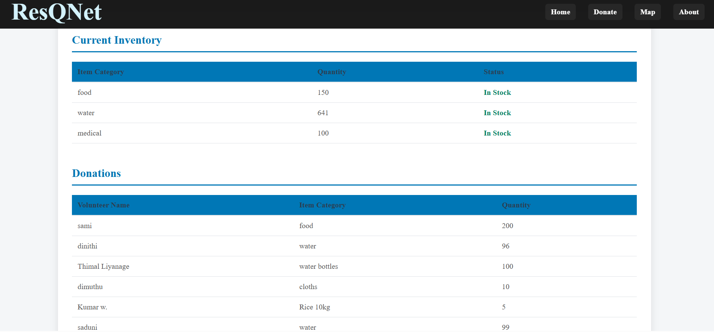

# ResqNet – Disaster Aid Distribution Platform

ResqNet is a full-stack web platform built to bring transparency, structure, and trust to disaster aid distribution in Sri Lanka.  
It enables public donations, verified aid center management, and real-time disaster severity tracking.

---

## 🚨 Overview

During major floods and landslides, donations often become difficult to coordinate.  
ResqNet solves this by providing:

- Public transparency  
- Verified local distribution  
- Real-time inventory visibility  
- Admin-level disaster management  

---

## 🔑 Core Features

### 👥 Public Features
- Donate without signing up  
- View real-time inventory of all aid centers  
- See all donors and their contributions  
- Interactive disaster severity map  

### 🛡️ Admin Dashboard
- Approve Aid Center Managers (certificate/ID verification)  
- Update disaster-affected areas + severity  
- View and manage all donations  
- Contact donors to collect items  
- Process manager inventory requests  
- Full real-time operations overview  

### 🧑‍💼 Aid Center Manager Dashboard
- Secure login after admin approval  
- Manage inventory  
- Add required items  
- Track pending / received / distributed items  
- Provide ground-level updates  

---

## 💻 Tech Stack

### Frontend
- React  
- Vite  
- Tailwind CSS (if used)

### Backend
- Node.js  
- Express.js  
- JWT Auth  
- REST APIs  

### Database
- PostgreSQL  
- Hosted on Supabase  

### Hosting
- Frontend → Vercel  
- Backend → Railway  
- Database → Supabase  

---

## 🎯 What I Learned

I learned to design full-stack architectures, build secure role-based systems, manage relational databases, and deploy a multi-service application end to end.

---

## 🖼️ Screenshots

Create a `/screenshots` folder and add your images.  
Then reference them like this:

```md
### 🔷 Home Page


### 🔷 Donations Page


### 🔷 Disaster Severity Map


### 🔷 Admin Dashboard


### 🔷 Manager Dashboard

